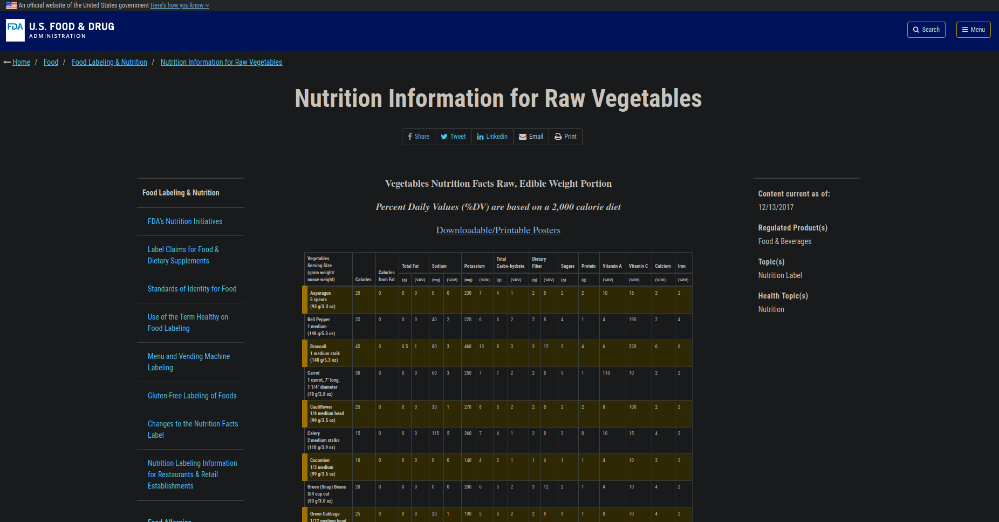
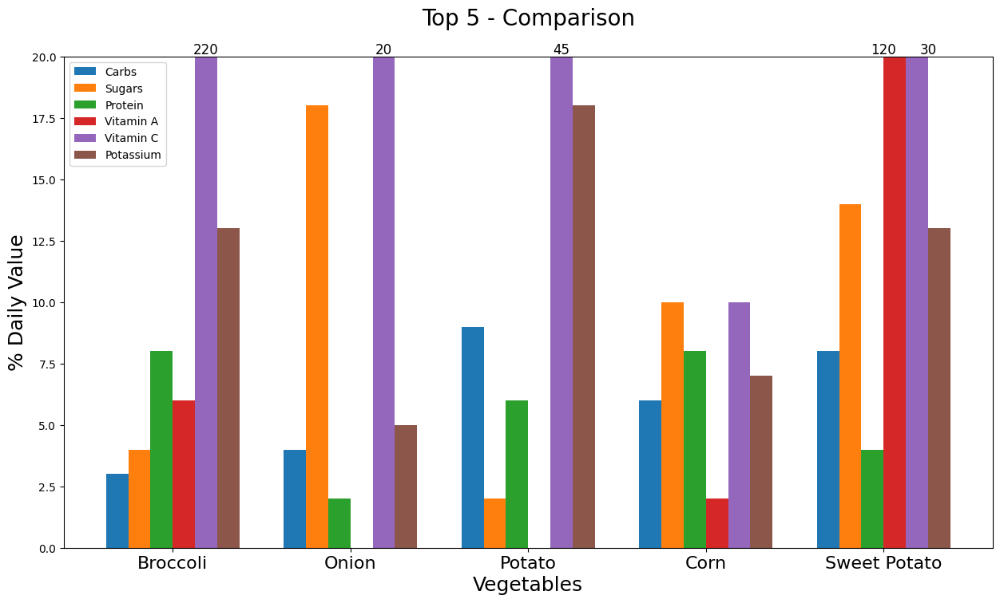

# Data Analytics / Science Portfolio
by Sebastian Kowollik

 

# [Project: Webscraping & EDA with Python in Jupyter Notebook](https://github.com/SebastianKowollik/Python-Webscraping-EDA-of-Vegetables)

 

* ## Webscraped data on vegetables from an [FDA website](https://www.fda.gov/food/food-labeling-nutrition/nutrition-information-raw-vegetables) to find the most nutritious vegetable

 

* ## Exploratory Data Analysis to find the most nutritious vegetable
    * ### Cleaning the data
    * ### Narrowing down the vegetables
    * ### Comparison of the top 5 most nutrient dense vegetables

## For further details and conclusion see [the Jupyter Notebook file](https://github.com/SebastianKowollik/Python-Webscraping-EDA-of-Vegetables)
